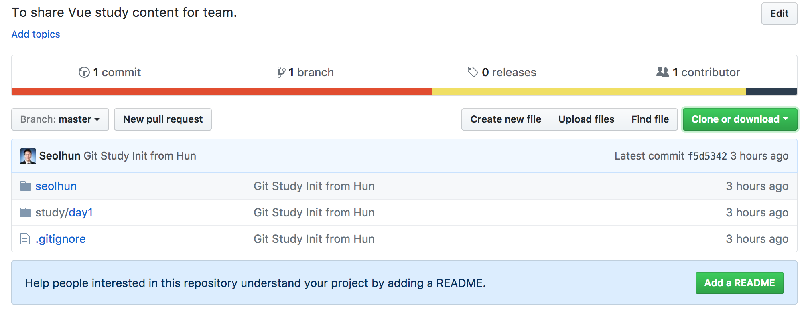

# Vue Study In Incheon

---
## Pre-Requirement
1. Git Install
	- [How to install Git](https://git-scm.com/book/en/v2/Getting-Started-Installing-Git)
	- [한국어 요약본](https://rogerdudler.github.io/git-guide/index.ko.html) : 요약본을 참고하여 많은 도움 받으시기 바랍니다.
2. Git clone in Git working directory
	- git clone https://github.com/Seolhun/kr-study-incheon.git
	- cd kr-study-incheon

3. Branch 생성
	- git branch [myname]
	- git branch

4. Branch 변경
	- git checkout [myname]

5. 자신의 폴더 만들기
	- mkdir [myname] 
	- cd myname
	- touch README.md
	- vim README.md
      ```
      # myname Test README.md
      ```
6. Git add(인덱싱) 하기
	- git status
	- git add .
		> .은 해당 폴더 파일 전부를 말하며, 해당 파일만 지명하여 추가할 수 있습니다.
	- git status

7. Git 커밋하기
	- git commit -m "Test Commit[This is commit message]"

8. Git 푸시하기
	- git push --set-upstream origin myname

9. Github 가서 확인하기
	- [Go to This Repository on GitHub](https://github.com/Seolhun/kr-study-incheon.git)
	> 

	- 해당 branch 버튼 클릭해서 자신의 branch 들어가기
	- 자신의 원하는 데로 들어갔는지 확인해보기. 

---
## Repository Rule
#### Important 
- - Contributor일 경우, Master Branch에는 절대 직접 커밋, 푸쉬하는 일이 없도록 해야합니다.


#### 1. 각자의 Branch를 관리한다.
- Branch name은 직관적으로 이름 혹은 이니셜로 한다. (ex. seolhun)

#### 2. Directory구분
- Root
	- project
		- branch와 같이 각자의 이름으로 directory를 만든다.
	- study
		- day1
        - day2
      	- day3
      	- ...
> 일자별 맡은 부분에 자신의 Study 요약내용을 넣어서 관리합니다. 관련 내용은 README.md로 작성하여 바로 볼 수 있게 합니다.


